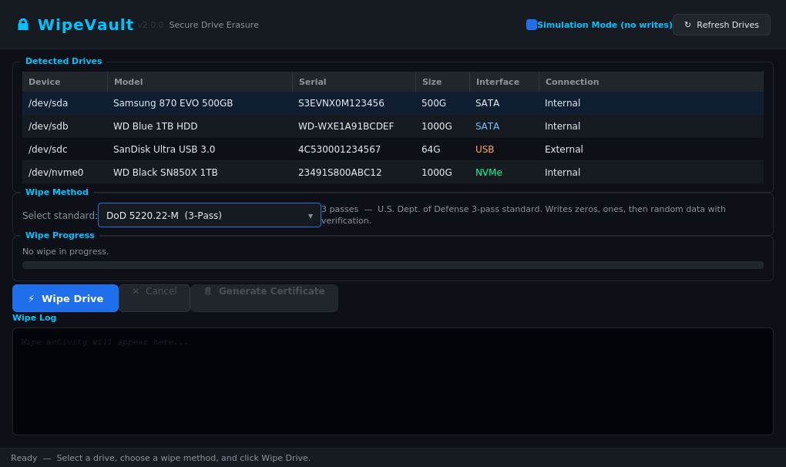
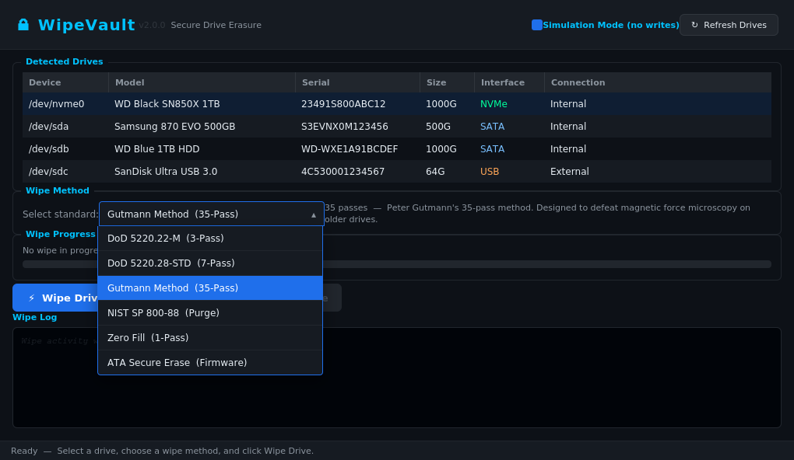
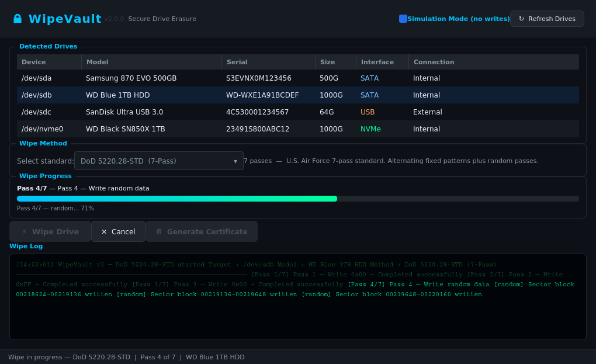
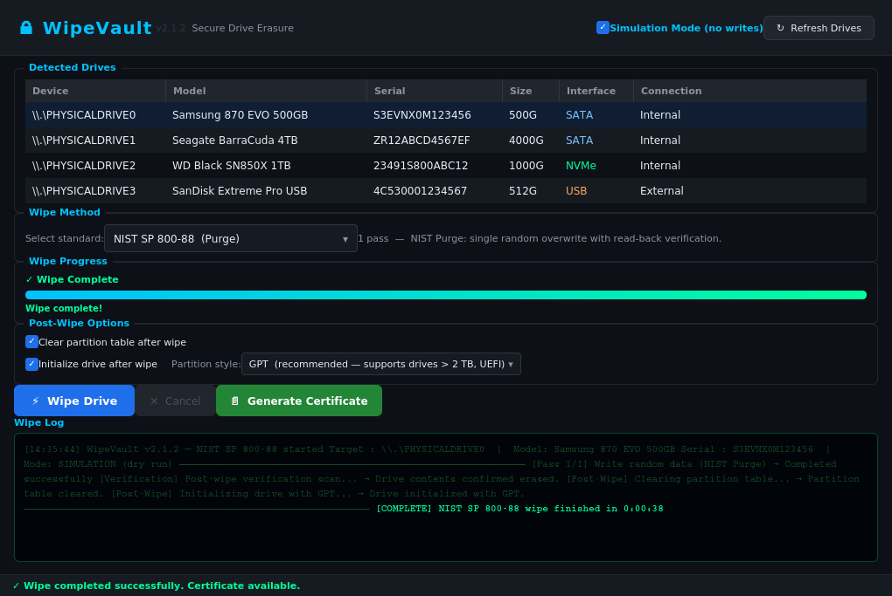

# 🔒 WipeVault


**DoD 5220.22-M Secure Drive Erasure Tool**

WipeVault is a cross-platform desktop application that performs certified, auditable three-pass data sanitization on hard drives, SSDs, USB drives, and NVMe drives — compliant with the U.S. Department of Defense 5220.22-M standard. Upon completion, it generates a professional PDF certificate of erasure documenting the serial number, drive details, wipe method, pass results, and technician/company information.

---

## ✨ Features

- **7 Wipe Standards** — DoD 5220.22-M, DoD 5220.28-STD, Gutmann 35-pass, NIST SP 800-88 Purge, NIST SP 800-88 Clear, Zero Fill, and ATA Secure Erase — selectable from a dropdown
- **Batch Wipe** — Select multiple drives with Ctrl/Shift and wipe them all simultaneously with per-drive progress tracking
- **Wipe History Log** — Every wipe is automatically recorded to a searchable archive; filter by drive, method, date, or result and export to CSV
- **Custom Certificate Logo** — Upload your company logo (PNG/JPG) to brand the PDF certificate
- **Certificate Signing & Tamper Verification** — Every certificate is signed with an HMAC-SHA256 signature; verify any certificate with the built-in verifier to detect tampering
- **Broad Drive Support** — Internal HDDs, SATA SSDs, NVMe drives, and external USB storage
- **Automatic Drive Detection** — Scans all connected drives with model, serial number, size, interface, and connection type; PowerShell primary with wmic fallback on Windows
- **Simulation Mode** — Safely rehearse a wipe without writing a single byte; great for training or testing
- **Post-Wipe Options** — Optionally clear the partition table and/or initialize the drive with a fresh GPT or MBR partition table
- **PDF Certificate of Erasure** — Full audit trail including drive info, wipe method, pass results, post-wipe operations, timing, and tamper-evident signature
- **Real-Time Wipe Log** — Live console-style output showing sector block progress for each pass
- **Auto UAC Elevation** — Automatically requests Administrator privileges on Windows
- **Cross-Platform** — Windows, macOS, Linux

---

## 🖥️ Screenshots

**Main Window — Drive Detection & Method Selection**


**Wipe Method Dropdown — All 6 Standards**


**Active Wipe — DoD 5220.28-STD 7-Pass In Progress**


**Wipe Complete — Certificate Ready**


---

## 🚀 Getting Started

### Prerequisites

- Python 3.10 or higher
- pip

### Installation

```bash
# Clone the repository
git clone https://github.com/HawaiizFynest/wipevault.git
cd wipevault

# Install dependencies
pip install -r requirements.txt
```

### Running the App

**Windows:**
```
WipeVault.bat
```
or
```
python run.py
```

**macOS / Linux:**
```bash
bash wipevault.sh
```
or
```bash
python3 run.py
```

> **⚠️ Important:** On Linux and macOS, performing a real (non-simulated) wipe requires running with `sudo` since writing directly to block devices requires elevated privileges. On Windows, run as Administrator.

---

## 📄 Certificate of Erasure

After a wipe completes, click **Generate Certificate** to produce a PDF report. You will be prompted to optionally provide:

| Field | Description |
|---|---|
| Company Name | Your organization's name |
| Website | Your company URL |
| Technician | Name of the person performing the wipe |
| Time Zone | Time zone for the timestamp on the certificate |

If left blank, the certificate defaults to **WipeVault** branding.

Certificates are saved to `~/WipeVault_Certs/` and named with the drive serial number and timestamp for easy archiving.

---

## 🔬 Wipe Standards

WipeVault v2 supports six industry-recognized data sanitization standards, selectable from a dropdown before each wipe:

| Method | Passes | Description |
|---|---|---|
| **DoD 5220.22-M** | 3 | U.S. DoD standard: zeros → ones → random + verify |
| **DoD 5220.28-STD** | 7 | U.S. Air Force standard: alternating fixed patterns + random passes |
| **Gutmann Method** | 35 | Peter Gutmann's method designed to defeat magnetic force microscopy on older drives |
| **NIST SP 800-88 Purge** | 1 | Single random overwrite with read-back verification |
| **NIST SP 800-88 Clear** | 2 | Zeros then ones overwrite; suitable for reuse within organization |
| **Zero Fill** | 1 | Single pass of 0x00 — fast, suitable for general reuse |
| **ATA Secure Erase** | 1 | Firmware-level erase command; fastest and most thorough for SSDs and NVMe |

---

## 🛠️ Building a Standalone Executable

WipeVault includes a PyInstaller spec file for building a single distributable binary.

```bash
pip install pyinstaller
python -m PyInstaller WipeVault.spec
```

Output is placed in the `dist/` folder:
- **Windows:** `dist/WipeVault.exe`
- **macOS:** `dist/WipeVault.app`
- **Linux:** `dist/WipeVault`

---

## 📁 Project Structure

```
wipevault/
├── src/
│   └── wipevault.py          # Main application (UI + wipe engine + certificate)
├── run.py                    # Cross-platform launcher script
├── WipeVault.bat             # Windows quick-launch
├── wipevault.sh              # macOS/Linux quick-launch
├── WipeVault.spec            # PyInstaller build spec
├── requirements.txt          # Python dependencies
├── .gitignore
└── README.md
```

---

## 🔮 Planned Features (Roadmap)

### ✅ Completed
- [x] DoD 5220.22-M 3-pass wipe
- [x] DoD 5220.28-STD 7-pass wipe
- [x] Gutmann 35-pass wipe mode
- [x] NIST SP 800-88 Purge standard
- [x] NIST SP 800-88 Clear standard
- [x] Zero Fill single-pass wipe
- [x] ATA Secure Erase (NVMe and SATA firmware command)
- [x] Wipe method selector dropdown
- [x] Batch wipe — select and wipe multiple drives simultaneously with per-drive progress
- [x] Wipe history log with searchable archive and CSV export
- [x] Custom certificate logo / company branding image upload
- [x] Certificate signing and HMAC-SHA256 tamper-evident verification
- [x] PDF certificate of erasure with full audit trail
- [x] Real-time wipe log with per-pass progress
- [x] Simulation mode (dry run)
- [x] Cross-platform builds via GitHub Actions (Windows, macOS, Linux)
- [x] Clear partition table (MBR/GPT) after wipe
- [x] Initialize drive with GPT or MBR after wipe
- [x] Auto UAC elevation on Windows

### 🔐 Future (Commercial Release)
- [ ] Product key / device-ID locking system
- [ ] Secure licensing database integration
- [ ] Encrypted application binary distribution
- [ ] Enterprise reporting and audit export (extended formats)
- [ ] White-label certificate theming for IT service companies
- [ ] Scheduled / automated wipe jobs
- [ ] Network drive support

---

## ⚖️ License

Copyright © 2025 WipeVault. All rights reserved.

This software is provided free of charge for personal and commercial use in its current form. Redistribution, modification, resale, or sublicensing of the source code or compiled binaries without explicit written permission from the author is prohibited.

A full commercial license with additional features, enterprise support, and distribution rights is planned for a future release.

---

## ⚠️ Disclaimer

WipeVault is a powerful data destruction tool. Wiped data **cannot be recovered**. Always verify you have selected the correct drive before initiating a live wipe. The authors accept no liability for accidental data loss. Use Simulation Mode to familiarize yourself with the application before performing any real wipes.

---

*WipeVault — Wipe with confidence. Certify with proof.*
